# tMinus

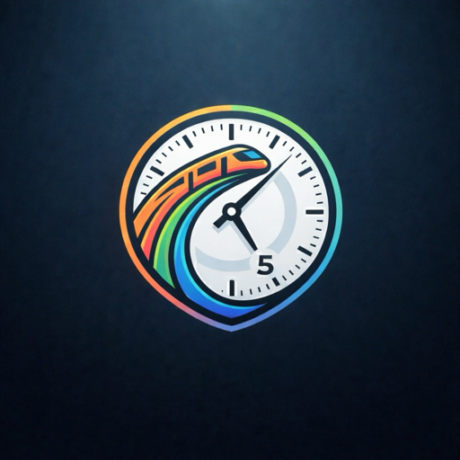

Open-source Android widgets and tools for MBTA riders. Application ID: **`com.saarlabs.tminus`**. The first feature is a **home screen trip widget** (Jetpack Glance) based on the contribution in [mbta/mobile_app#1593](https://github.com/mbta/mobile_app/pull/1593), adapted to call the public **MBTA V3 API** directly.

In one sentence: **star the stops you use, and tMinus tells you when to leave** — on the home screen
as a widget, on Home as a live board, and as a notification when a train you care about is coming.

There is no account and no onboarding. Everything works without an API key.

## What it looks like

All screenshots below are from a real device running the current `main` build against live MBTA data.

### Home answers "when is my next train" first

Star any stop from any picker and it becomes a board on Home. Under the boards sit the three things
you can set up, then a tip card for first-run orientation.

| Live boards | Boards keep going | Set-up & tip | Dark theme |
| --- | --- | --- | --- |
| 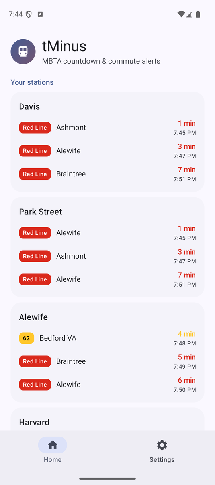 | 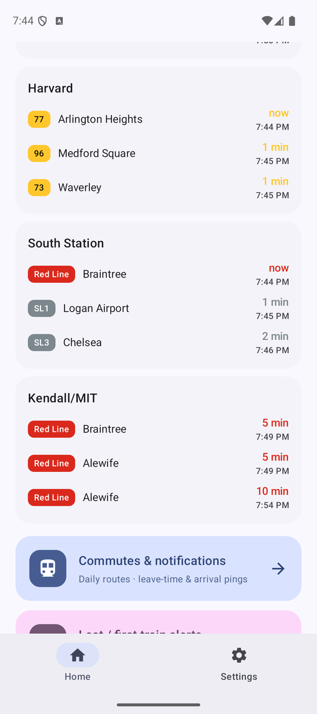 | 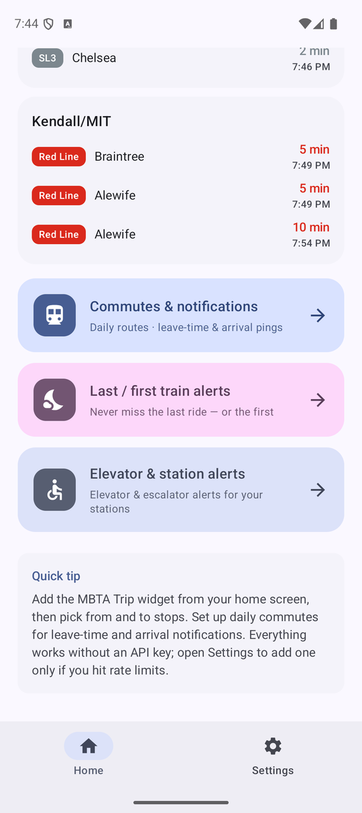 | 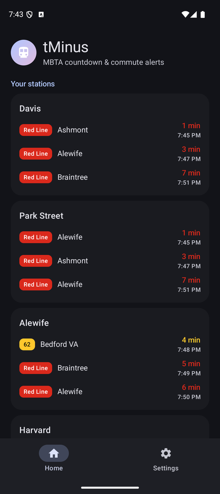 |

Each row is a real departure: route badge in the MBTA line colour, headsign, minutes remaining, and
the clock time. Minutes are colour-coded so "leave now" reads at a glance.

### Home screen widgets

Four Jetpack Glance widgets, all added from the system widget picker. Each one asks for its
configuration as you drop it, and each recomputes its countdown locally between network refreshes.

| | |
| --- | --- |
| 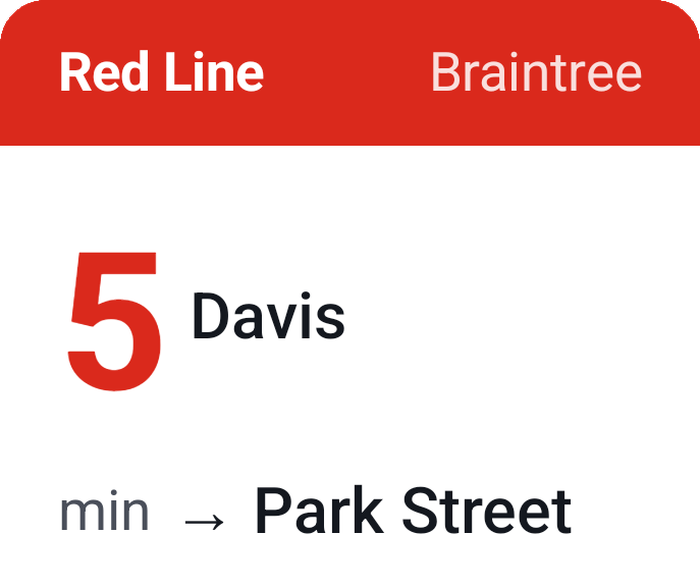<br />**Next trip** — the next scheduled trip between two stops. Big countdown, line colour, and the from → to pair. | 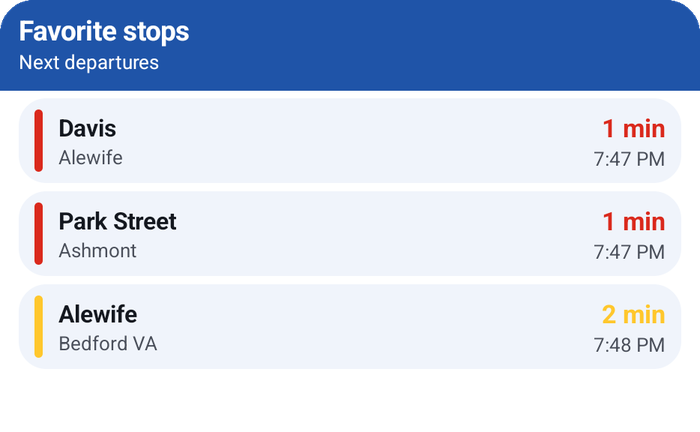<br />**Favorite stops** — the next departure from each starred stop. Show 3, 5 or 8, optionally sorted by soonest. |
| 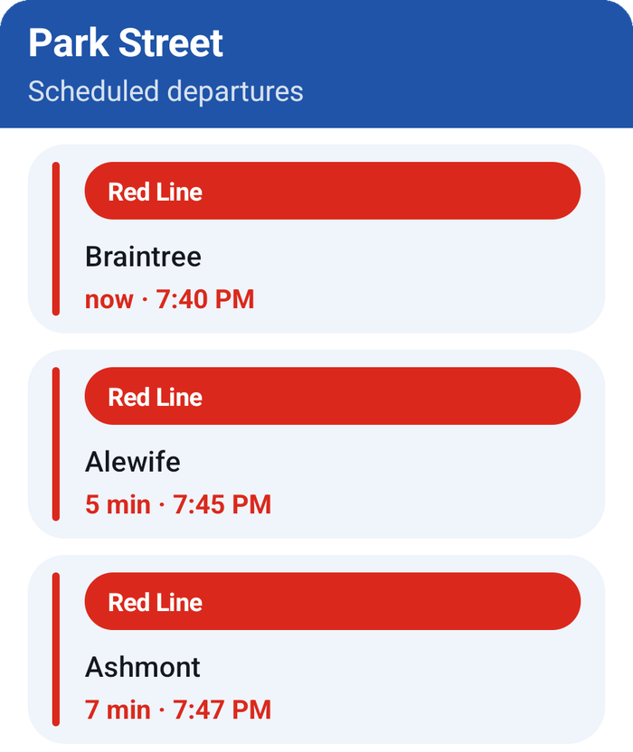<br />**Station board** — a departure board for one stop, optionally filtered to a single line. | 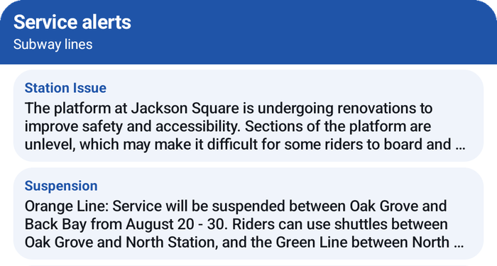<br />**Service alerts** — active alerts on the lines you pick, with the effect named up front. |

Widgets are resizable, and the next trip widget re-lays itself out rather than just scaling: stack
the countdown above the stops when the widget is roughly square, put it beside them when it is wide,
and fall back to a single row when it is only one cell tall.

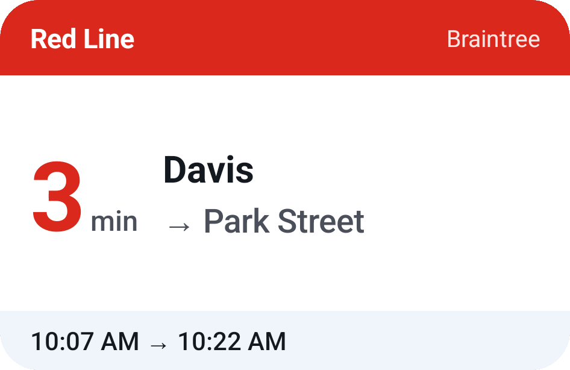

On the home screen:

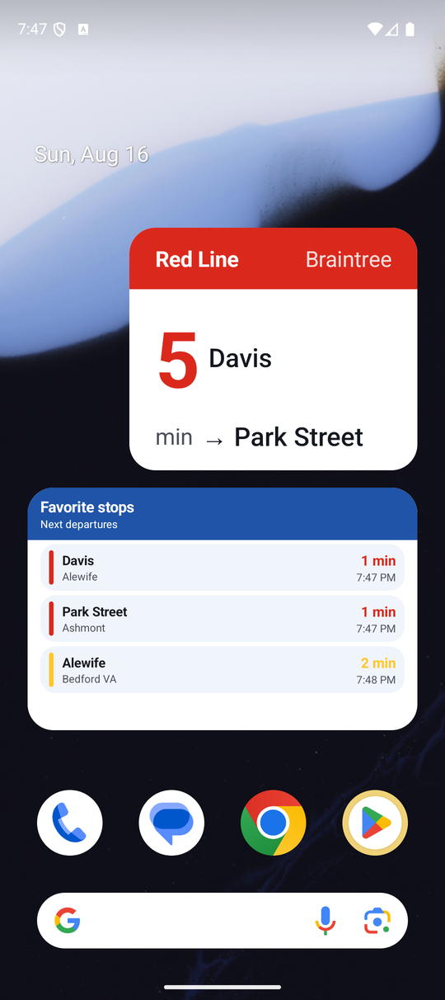

Dropping a widget opens its configuration immediately — no trip to the app and back:

| Next trip | Station board | Favorite stops | Service alerts |
| --- | --- | --- | --- |
|  | 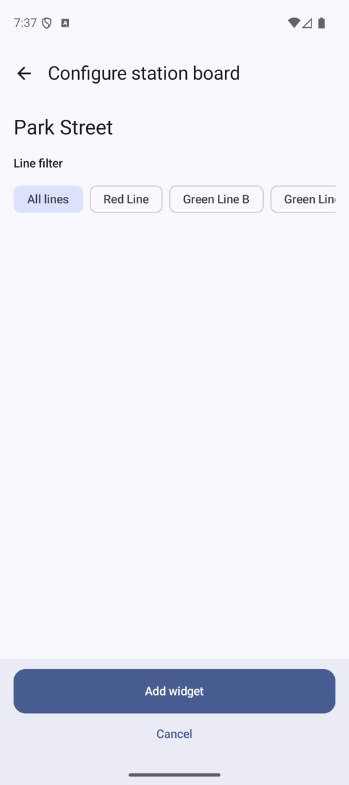 | 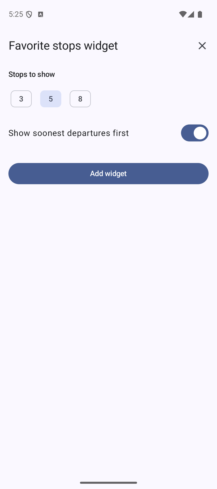 | 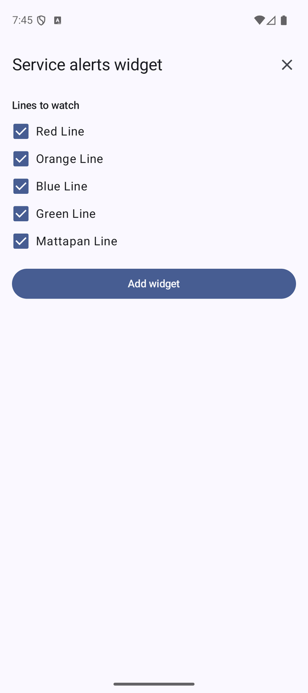 |

### Commutes — a leave-time notification for a route you actually ride

Name a route, pick the days, set a target arrival, and tMinus works backwards to when you should
leave. **Preview next trip in window** resolves a real trip before you save, so you can tell
immediately whether the window you chose finds anything.

| Saved commutes | Editor | Preview before saving |
| --- | --- | --- |
| 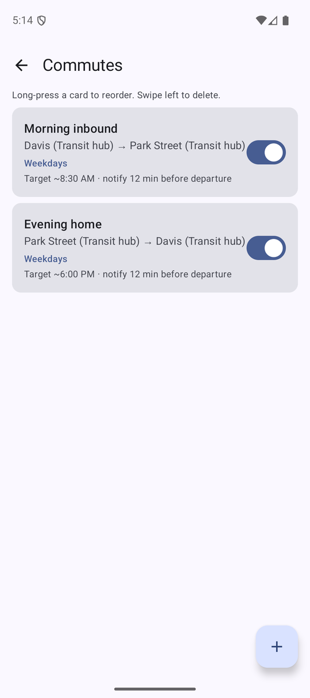 | 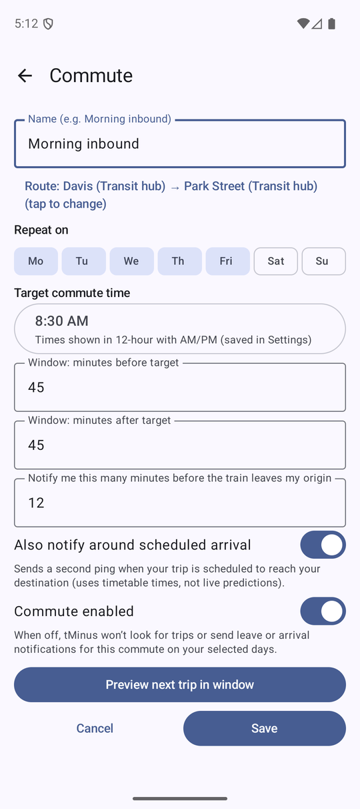 | 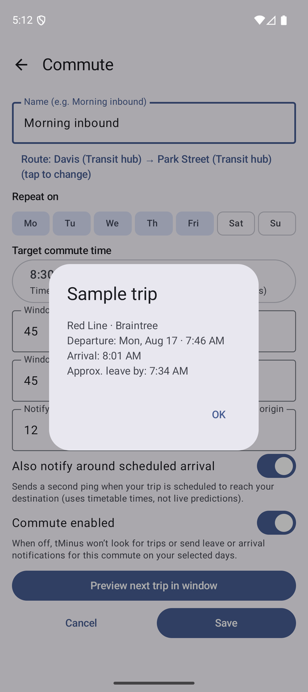 |

Each saved card states its own behaviour — route, days, target, lead time — and carries an enable
toggle, so pausing a commute never means deleting it.

### Last / first train, and station accessibility

| Last & first train alerts | Alert editor | Elevator & station alerts |
| --- | --- | --- |
| 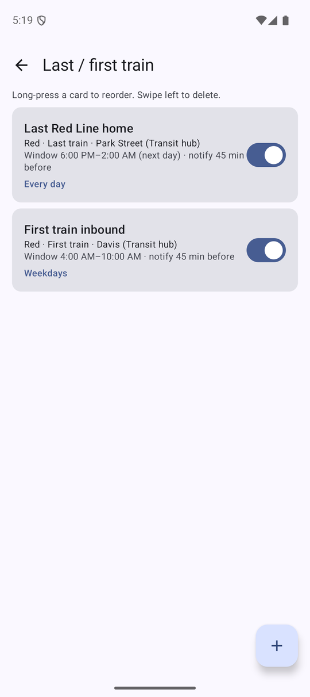 | 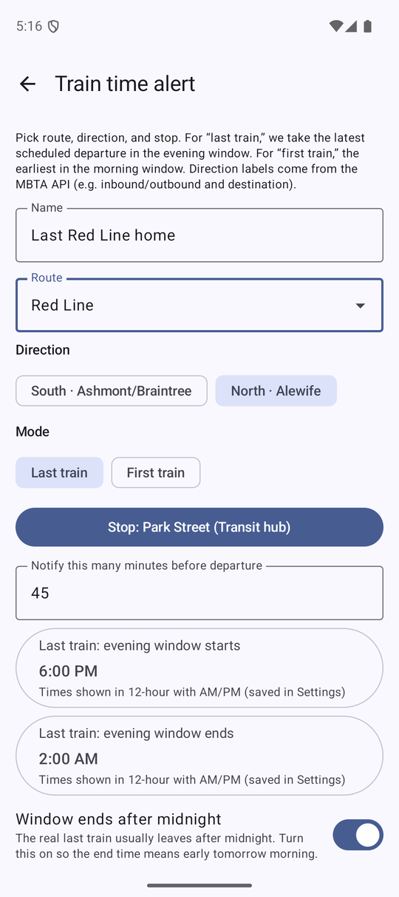 | 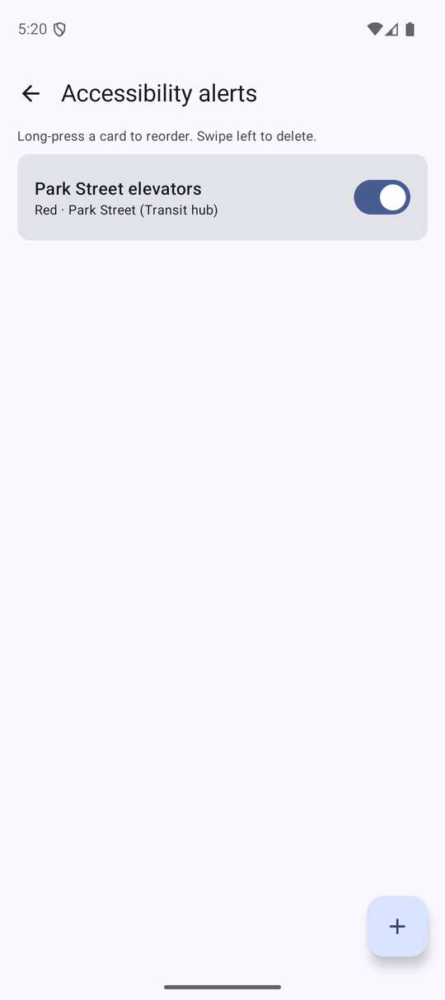 |

Direction labels ("North · Alewife") come from the MBTA API rather than being hardcoded, and the
last-train window can legitimately end at 2:00 AM — the toggle below it says so in words.

### Stop pickers

~9,000 stops, searched off the main thread. Starred stops float to the top of every picker, and
where a route is already chosen the list narrows to stops that route actually serves.

| Every stop, favourites first | Only stops on the chosen route |
| --- | --- |
| 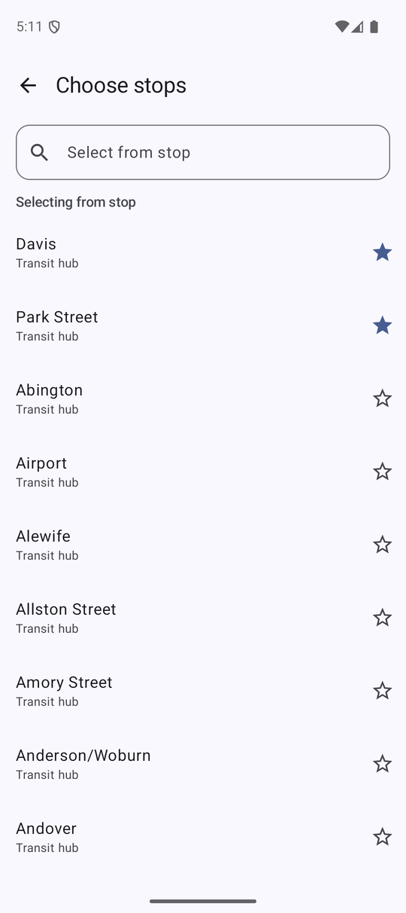 | 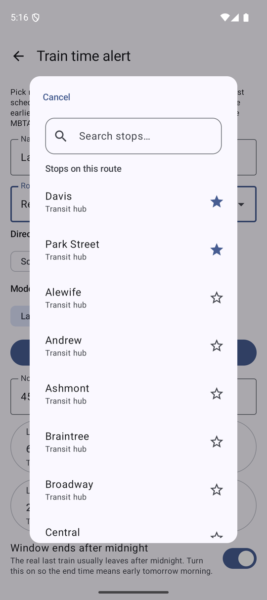 |

### Settings

| Appearance, text size, time format | Keys, alarms, links |
| --- | --- |
| 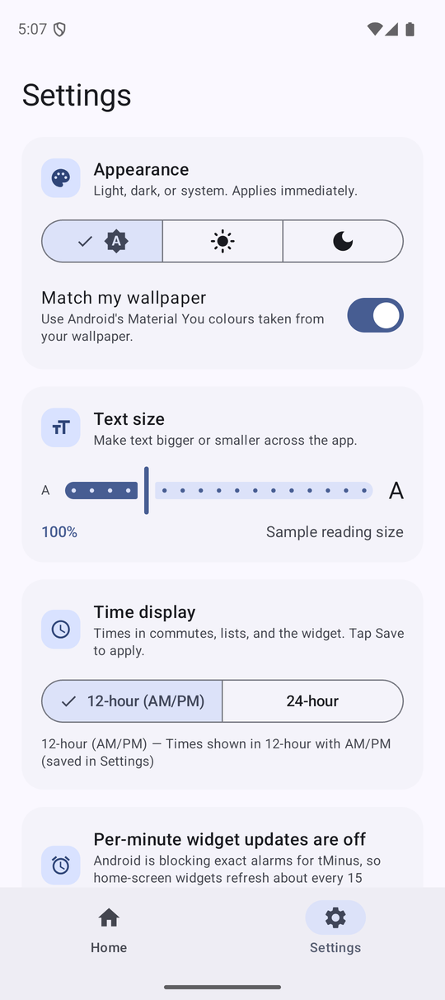 | 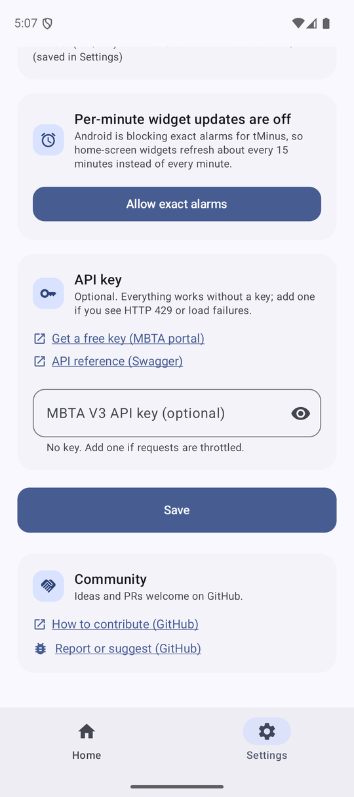 |

Theme, dynamic colour, text size and 12/24-hour time are all user choices. Settings also surfaces
*why* widgets may be refreshing slowly (Android withholding exact alarms) instead of leaving it a
mystery, and the API key is optional throughout.

## How it works

**Commutes.** Save as many named routes as you like: from/to stops, days of week, a target time, and
a window (minutes before/after) used to query schedules. Set *notify X minutes before departure* for
a "time to leave" notification, and optionally a second ping around scheduled arrival. Checks run on
a background schedule (about every 15 minutes) using **schedule data** from the MBTA V3 API — not
live predictions. Grant notification permission on Android 13+ when prompted.

**Last / first train.** Pick a route, direction, and stop (only stops the route actually serves are
offered), last-vs-first mode, a time window, and how many minutes before that scheduled departure to
notify. Last-train windows can run past midnight, which is when the last train usually goes.

**Elevator & station alerts.** Watch a route + station; the app asks the MBTA for active alerts
affecting that station (elevator/escalator/stop-closure effects) and notifies you. Matching uses the
API's own stop filter, so it reflects exactly what the MBTA has published for that stop.

**Widgets.** All four are Jetpack Glance and appear in the system widget picker. A widget tick never
hits the network — countdowns are recomputed locally from cached timetables, so the number stays
honest between refreshes.

## API keys (optional but recommended)

The app works without keys for light use. For higher rate limits, request a free key from the V3 portal and paste it in **Settings** inside the app.

- **V3 API (schedules, stops, routes):** [MBTA Developers — V3 API](https://www.mbta.com/developers/v3-api) and [V3 API Portal](https://api-v3.mbta.com/) — paste your key in **Settings** in the app.

## Development

- [Architecture notes](docs/ARCHITECTURE.md) — module layout, the widget lifecycle, service-day
  handling, and the performance rules. Worth reading before changing widgets.
- [Working in this repository](CLAUDE.md) — conventions and the mistakes this codebase invites.
- [Changelog](CHANGELOG.md)

```bash
./gradlew test               # unit tests
./gradlew :app:lintDebug     # Android Lint
./gradlew assembleRelease    # run this before pushing resource changes
```

## Build locally

1. Install [Android Studio](https://developer.android.com/studio) or the Android SDK and set `ANDROID_HOME`.
2. Clone this repository.
3. From the project root:

```bash
./gradlew assembleDebug
```

Install `app/build/outputs/apk/debug/app-debug.apk` on your device.

## Contributing

See [CONTRIBUTING.md](CONTRIBUTING.md) for how to report issues, submit pull requests, and set up a dev environment. Please also read the [Code of Conduct](CODE_OF_CONDUCT.md).

Security issues should go through a [private advisory](https://github.com/saarhaber/Tminus/security/advisories/new) rather than a public issue — see [SECURITY.md](SECURITY.md).

## Privacy

tMinus talks to `https://api-v3.mbta.com` and nothing else. There is no account, no analytics and no
crash reporting. Your API key, if you set one, stays on the device and is excluded from cloud backup.

## CI and installable APK

GitHub Actions runs unit tests and Android Lint, then builds debug and release APKs on each push, and
uploads the debug APK as a workflow artifact (`tminus-debug-apk`).

**Rolling build from `main`:** each merge to `main` updates the prerelease [**Latest main (debug)**](https://github.com/saarhaber/Tminus/releases/tag/latest-main) on the Releases page with a fresh `app-debug.apk` (tag `latest-main`). The release title and description include a **Built (UTC)** time so you can tell when the APK last changed—GitHub’s own “published” date for that rolling entry can stay stale.

**Versioned release:** create and push a tag such as `v0.1.0`; the [tag release workflow](.github/workflows/release-apk.yml) attaches the debug APK to that numbered release.

## License

Apache-2.0 (see [LICENSE](LICENSE)).
